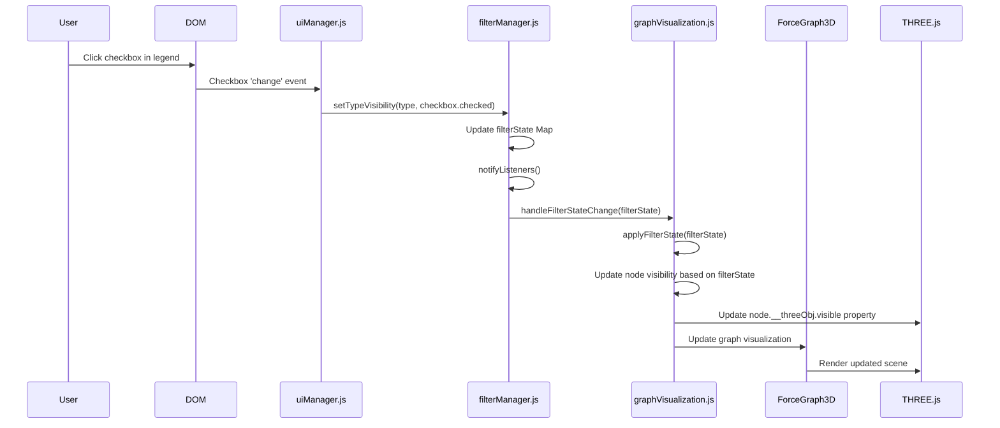

# Legend Checkbox Click Flow

This document outlines the sequence of events that occur when a user clicks on a checkbox in the legend. The diagram shows the interaction between different components during this user interaction.

## Legend Checkbox Click Flow

1. The user clicks on a checkbox in the legend.
2. The checkbox's 'change' event is triggered, which was set up in the `createNodeLegendItem()` function.
3. The event handler calls `filterManager.setTypeVisibility(type, checkbox.checked)` to update the visibility state.
4. The `setTypeVisibility()` method in FilterManager:
   - Updates the filter state for the specified node type
   - Calls `notifyListeners()` to notify all registered listeners of the state change
5. The `handleFilterStateChange()` function in graphVisualization.js is called as a listener.
6. This function calls `applyFilterState(filterState)` to update the graph visualization.
7. The `applyFilterState()` function:
   - Iterates through all nodes in the graph
   - Updates the visibility of each node based on its type and the filter state
   - Updates the THREE.js object's visibility property
8. The ForceGraph3D library renders the updated scene with the new visibility states.

This sequence diagram provides a clear visualization of how the different components interact when a user toggles the visibility of a node type in the legend. 

## Component Descriptions

### Internal Files
- **uiManager.js**: Manages UI elements, including the legend and checkboxes.
- **filterManager.js**: Manages the visibility state of different node types.
- **graphVisualization.js**: Handles the 3D graph visualization and updates.

### Third-Party Libraries
- **THREE.js**: A JavaScript 3D library used for rendering the graph.
- **ForceGraph3D**: A 3D force-directed graph visualization library built on top of THREE.js.
