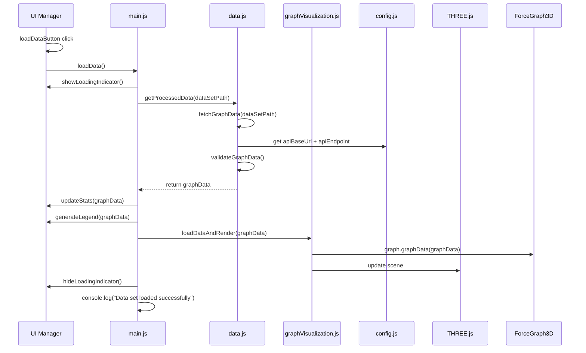

# Load Data Flow

This document outlines the data loading sequence of the Knowledge Graph Viewer application using a sequence diagram. The diagram shows the interaction between different components when loading a new data set.

## Loading Flow

1. When the Load button is clicked, the UI manager triggers the load data function.
2. The application shows a loading indicator and fetches graph data from the server.
3. The data is validated and processed.
4. The UI is updated with the new data:
   - Statistics are updated
   - Legend is regenerated
   - Graph visualization is updated
5. The loading indicator is hidden, and the loading is complete.

This sequence diagram provides a clear visualization of how the different components interact during the data loading process.

## Component Descriptions

### Internal Files
- **uiManager.js**: Handles UI events and updates
- **main.js**: Orchestrates the data loading process
- **data.js**: Handles data fetching, validation, and processing
- **graphVisualization.js**: Updates the graph visualization
- **config.js**: Provides configuration constants for the application
