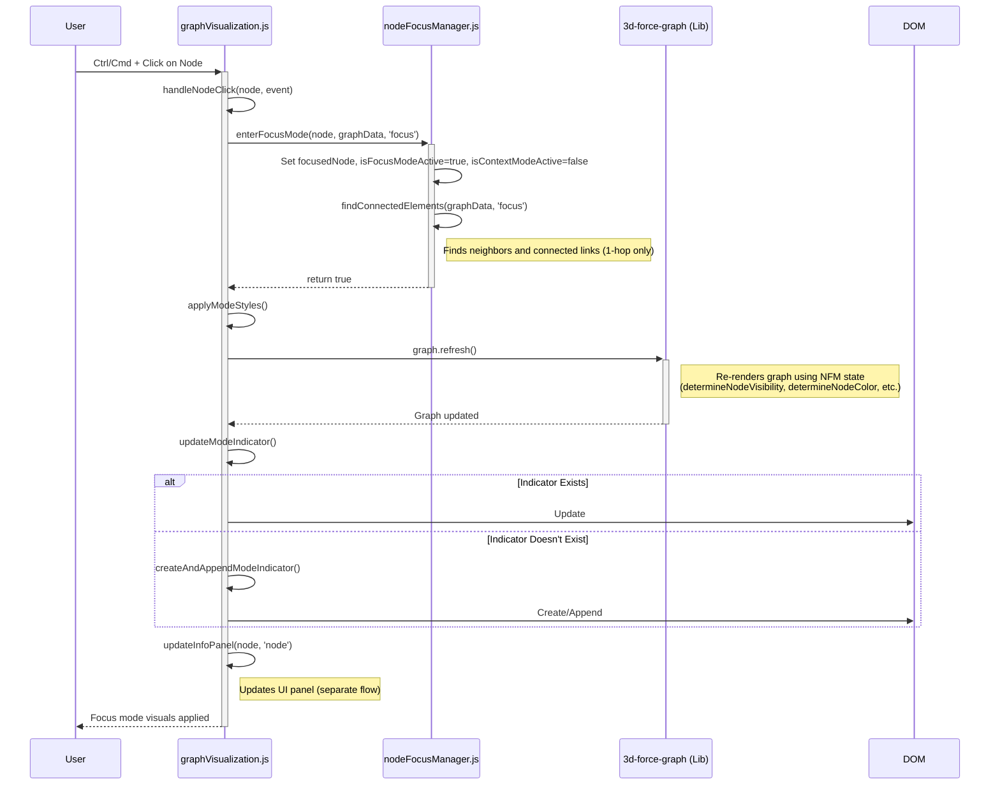
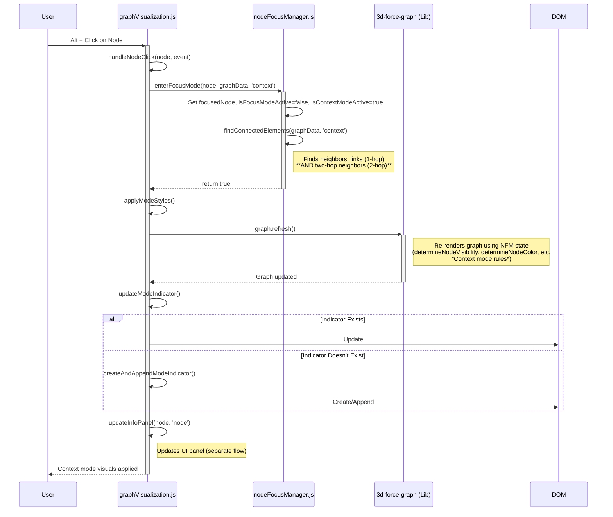
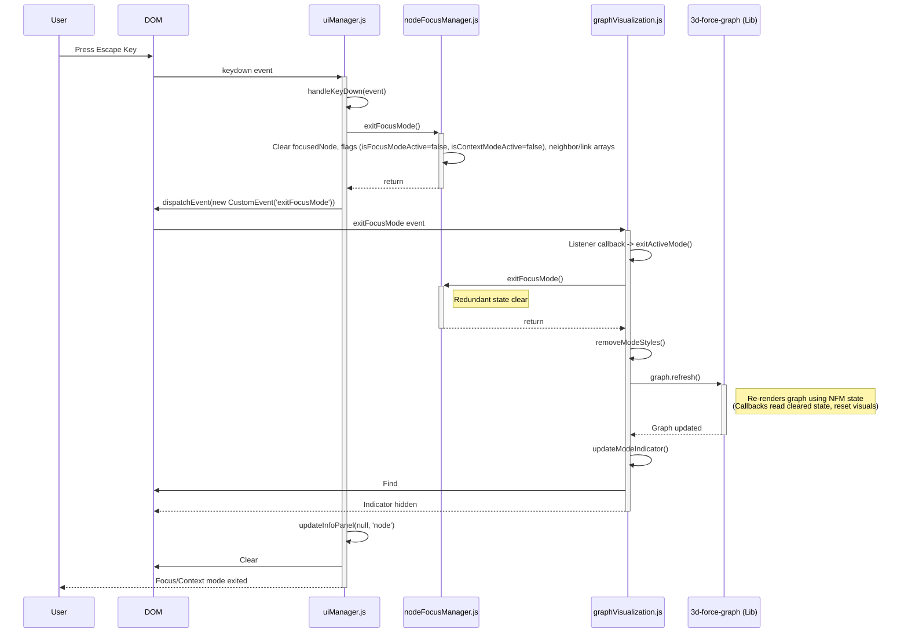
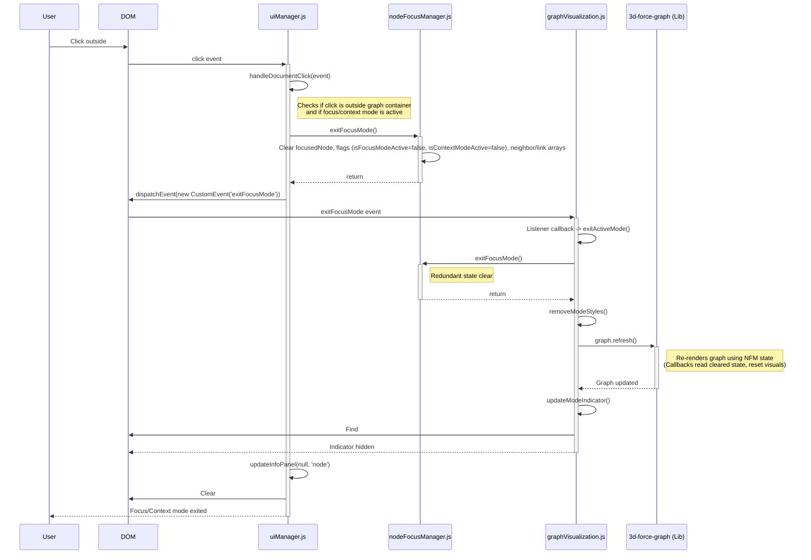

# Node Focus/Context Mode Entry Flows

This document details the sequence of events that occur when entering Focus Mode or Context Mode by interacting with a node in the graph visualization.

## Entering Focus Mode

This mode highlights the selected node and its immediate neighbors, dimming the rest of the graph.

**Detailed Flow Description:**

1.  **User Action:** The user holds down the `Ctrl` key (or `Cmd` key on macOS) and clicks on a node in the graph visualization.
2.  **Event Handler:** The click event triggers the [`handleNodeClick`](../../js/graphVisualization.js#L360) function within `js/graphVisualization.js`.
3.  **Mode Check:** Inside `handleNodeClick`, the code checks if the `Ctrl` or `Meta` key was pressed (`isCtrlPressed` evaluates to true) ([`js/graphVisualization.js#L364`](../../js/graphVisualization.js#L364), [`#L371`](../../js/graphVisualization.js#L371)).
4.  **Enter Focus Mode State:** The function calls `nodeFocusManager.enterFocusMode(node, graphData, FOCUS_MODE)` ([`js/graphVisualization.js#L372`](../../js/graphVisualization.js#L372)).
5.  **NodeFocusManager Logic (`enterFocusMode`):** Within `js/nodeFocusManager.js`, the [`enterFocusMode`](../../js/nodeFocusManager.js#L40) method:
    *   Sets the `this.focusedNode` to the clicked node.
    *   Sets the state flag `this.isFocusModeActive = true`.
    *   Sets the state flag `this.isContextModeActive = false`.
    *   Calls `this.findConnectedElements(graphData, 'focus')` ([`js/nodeFocusManager.js#L52`](../../js/nodeFocusManager.js#L52)).
6.  **Find Connections (`findConnectedElements`):** The [`findConnectedElements`](../../js/nodeFocusManager.js#L76) method in `nodeFocusManager` identifies:
    *   Nodes directly linked to the `focusedNode` (neighbors).
    *   Links connecting the `focusedNode` to its neighbors (incoming/outgoing links).
    *   *Crucially, it does **not** look for two-hop neighbors in 'focus' mode.*
7.  **Apply Visual Styles:** Back in `handleNodeClick`, the [`applyModeStyles`](../../js/graphVisualization.js#L373) function is called ([`js/graphVisualization.js#L529`](../../js/graphVisualization.js#L529)).
8.  **Graph Refresh (`applyModeStyles`):**
    *   It calls `graph.refresh()` ([`js/graphVisualization.js#L534`](../../js/graphVisualization.js#L534)). This is a call to the external `3d-force-graph` library. The library redraws the graph, using callback functions like [`determineNodeVisibility`](../../js/graphVisualization.js#L170), [`determineLinkVisibility`](../../js/graphVisualization.js#L187), [`determineNodeColor`](../../js/graphVisualization.js#L240), [`determineLinkColor`](../../js/graphVisualization.js#L204), and [`determineLinkParticles`](../../js/graphVisualization.js#L227). These callbacks read the state (`isFocusModeActive`, `focusedNode`, `neighborNodes`) from the `nodeFocusManager` instance to apply the focus mode styling (dimming non-neighbors, coloring focused/neighbor nodes, etc.).
9.  **Update Indicator (`applyModeStyles`):**
    *   It calls [`updateModeIndicator`](../../js/graphVisualization.js#L537).
10. **DOM Manipulation (`updateModeIndicator`):** The [`updateModeIndicator`](../../js/graphVisualization.js#L562) function finds or creates ([`createAndAppendModeIndicator`](../../js/graphVisualization.js#L551)) a `div` element with the ID `#focus-indicator` in the HTML DOM. It sets its text content to the focus mode indicator text (from `config.js`) and makes it visible.
11. **Info Panel Update:** Finally, `handleNodeClick` calls [`updateInfoPanel(node, 'node')`](../../js/graphVisualization.js#L383) (from `js/uiManager.js`) to display details about the clicked node in the UI. This happens after the focus mode state and visuals have been initiated.

## Entering Context Mode

This mode highlights the selected node, its immediate neighbors, *and* its two-hop neighbors (neighbors of neighbors), dimming the rest of the graph. It provides more surrounding context than Focus Mode.

**Detailed Flow Description:**

1.  **User Action:** The user holds down the `Alt` key (or `Option` key on macOS) and clicks on a node in the graph visualization.
2.  **Event Handler:** The click event triggers the [`handleNodeClick`](../../js/graphVisualization.js#L360) function within `js/graphVisualization.js`.
3.  **Mode Check:** Inside `handleNodeClick`, the code checks if the `Alt` key was pressed (`isAltPressed` evaluates to true) ([`js/graphVisualization.js#L363`](../../js/graphVisualization.js#L363), [`#L366`](../../js/graphVisualization.js#L366)).
4.  **Enter Context Mode State:** The function calls `nodeFocusManager.enterFocusMode(node, graphData, CONTEXT_MODE)` ([`js/graphVisualization.js#L367`](../../js/graphVisualization.js#L367)).
5.  **NodeFocusManager Logic (`enterFocusMode`):** Within `js/nodeFocusManager.js`, the [`enterFocusMode`](../../js/nodeFocusManager.js#L40) method:
    *   Sets the `this.focusedNode` to the clicked node.
    *   Sets the state flag `this.isFocusModeActive = false`.
    *   Sets the state flag `this.isContextModeActive = true`.
    *   Calls `this.findConnectedElements(graphData, 'context')` ([`js/nodeFocusManager.js#L52`](../../js/nodeFocusManager.js#L52)).
6.  **Find Connections (`findConnectedElements`):** The [`findConnectedElements`](../../js/nodeFocusManager.js#L76) method in `nodeFocusManager` identifies:
    *   Nodes directly linked to the `focusedNode` (neighbors).
    *   Links connecting the `focusedNode` to its neighbors (incoming/outgoing links).
    *   **Key Difference:** Because the `mode` parameter is `'context'`, it executes additional logic ([`js/nodeFocusManager.js#L122`](../../js/nodeFocusManager.js#L122)) to find *two-hop neighbors* - nodes connected to the immediate neighbors, excluding the focused node and the neighbors themselves. These are stored in `this.twoHopNeighborNodes`.
7.  **Apply Visual Styles:** Back in `handleNodeClick`, the [`applyModeStyles`](../../js/graphVisualization.js#L368) function is called ([`js/graphVisualization.js#L529`](../../js/graphVisualization.js#L529)).
8.  **Graph Refresh (`applyModeStyles`):**
    *   It calls `graph.refresh()` ([`js/graphVisualization.js#L534`](../../js/graphVisualization.js#L534)). This triggers the `3d-force-graph` library redraw. The callbacks ([`determineNodeVisibility`](../../js/graphVisualization.js#L170), [`determineLinkVisibility`](../../js/graphVisualization.js#L187), [`determineNodeColor`](../../js/graphVisualization.js#L240), etc.) read the state from `nodeFocusManager` (`isContextModeActive`, `focusedNode`, `neighborNodes`, `twoHopNeighborNodes`). They apply context-specific visibility rules (showing focused, neighbors, and two-hop nodes) and coloring.
9.  **Update Indicator (`applyModeStyles`):**
    *   It calls [`updateModeIndicator`](../../js/graphVisualization.js#L537).
10. **DOM Manipulation (`updateModeIndicator`):** The [`updateModeIndicator`](../../js/graphVisualization.js#L562) function finds or creates ([`createAndAppendModeIndicator`](../../js/graphVisualization.js#L551)) the `#focus-indicator` `div`. It sets its text content to the context mode indicator text (from `config.js`) and makes it visible.
11. **Info Panel Update:** Finally, `handleNodeClick` calls [`updateInfoPanel(node, 'node')`](../../js/graphVisualization.js#L383) to display details about the clicked node in the UI, after the context mode state and visuals have been initiated.

## Exiting Focus/Context Mode

This section details the sequence of events when the user exits Focus or Context mode, either by pressing the Escape key or clicking outside the graph container.

### Exiting via Escape Key

**Detailed Flow Description:**

1.  **User Action:** User presses the `Escape` key.
2.  **Event Handler:** The DOM triggers the `keydown` event listener in `js/uiManager.js`, calling [`handleKeyDown`](../../js/uiManager.js#L115).
3.  **Condition Check:** `handleKeyDown` verifies the key is `Escape` and that either focus or context mode is active ([`js/uiManager.js#L117`](../../js/uiManager.js#L117)).
4.  **State Reset:** Calls `nodeFocusManager.exitFocusMode()` ([`js/uiManager.js#L120`](../../js/uiManager.js#L120)).
5.  **NodeFocusManager Logic (`exitFocusMode`):** Within `js/nodeFocusManager.js`, the [`exitFocusMode`](../../js/nodeFocusManager.js#L62) method resets the state: sets `focusedNode` to `null`, `isFocusModeActive` and `isContextModeActive` to `false`, and clears related arrays (neighbors, links).
6.  **Event Dispatch:** `handleKeyDown` dispatches a custom `exitFocusMode` event on the `document` ([`js/uiManager.js#L124`](../../js/uiManager.js#L124)).
7.  **Event Listener (GraphVisualization):** The event listener setup in [`initGraphVisualization`](../../js/graphVisualization.js#L67) (specifically line [`#L152`](../../js/graphVisualization.js#L152)) catches the event and triggers its callback, which calls `exitActiveMode()`.
8.  **Exit Active Mode Logic (`exitActiveMode`):** The [`exitActiveMode`](../../js/graphVisualization.js#L401) function is called:
    *   It redundantly calls `nodeFocusManager.exitFocusMode()` again ([`js/graphVisualization.js#L402`](../../js/graphVisualization.js#L402)).
    *   It calls [`removeModeStyles()`](../../js/graphVisualization.js#L403).
9.  **Remove Visual Styles (`removeModeStyles`):** The [`removeModeStyles`](../../js/graphVisualization.js#L549) function:
    *   Calls `graph.refresh()` ([`js/graphVisualization.js#L556`](../../js/graphVisualization.js#L556)). The `3d-force-graph` library redraws, using callbacks like [`determineNodeVisibility`](../../js/graphVisualization.js#L170) and [`determineNodeColor`](../../js/graphVisualization.js#L240). Since `nodeFocusManager` state is now cleared, the graph resets to its default appearance (no dimming, default colors).
    *   Calls [`updateModeIndicator()`](../../js/graphVisualization.js#L558).
10. **Update Indicator (`updateModeIndicator`):** The [`updateModeIndicator`](../../js/graphVisualization.js#L578) function finds the `#focus-indicator` element and, because neither mode flag is active, hides it using `style.display = 'none'` ([`js/graphVisualization.js#L597`](../../js/graphVisualization.js#L597)).
11. **Info Panel Update:** Back in `handleKeyDown`, `updateInfoPanel(null, 'node')` is called ([`js/uiManager.js#L128`](../../js/uiManager.js#L128)), clearing the details in the info panel UI element.

### Exiting via Click Outside

**Detailed Flow Description:**

1.  **User Action:** User clicks the mouse anywhere in the document *outside* the main graph container element (`#graph-container`).
2.  **Event Handler:** The DOM triggers the `click` event listener added in `initUIManager` (`js/uiManager.js`), calling [`handleDocumentClick`](../../js/uiManager.js#L138).
3.  **Condition Check:** `handleDocumentClick` verifies that the click target is *not* inside the graph container (`!graphContainer.contains(event.target)`) and that either focus or context mode is active ([`js/uiManager.js#L141-L143`](../../js/uiManager.js#L141)).
4.  **State Reset:** Calls `nodeFocusManager.exitFocusMode()` ([`js/uiManager.js#L147`](../../js/uiManager.js#L147)).
5.  **NodeFocusManager Logic (`exitFocusMode`):** Identical to step 5 in the Escape Key flow: [`exitFocusMode`](../../js/nodeFocusManager.js#L62) resets the state in the `nodeFocusManager`.
6.  **Event Dispatch:** `handleDocumentClick` dispatches a custom `exitFocusMode` event on the `document` ([`js/uiManager.js#L150`](../../js/uiManager.js#L150)).
7.  **Event Listener (GraphVisualization):** Identical to step 7 in the Escape Key flow: The listener in `graphVisualization.js` ([`#L152`](../../js/graphVisualization.js#L152)) catches the event and calls `exitActiveMode()`.
8.  **Exit Active Mode Logic (`exitActiveMode`):** Identical to step 8 in the Escape Key flow: [`exitActiveMode`](../../js/graphVisualization.js#L401) calls `nodeFocusManager.exitFocusMode()` (redundant) and `removeModeStyles()`.
9.  **Remove Visual Styles (`removeModeStyles`):** Identical to step 9 in the Escape Key flow: [`removeModeStyles`](../../js/graphVisualization.js#L549) calls `graph.refresh()` (resetting visuals via callbacks reading cleared state) and `updateModeIndicator()`.
10. **Update Indicator (`updateModeIndicator`):** Identical to step 10 in the Escape Key flow: [`updateModeIndicator`](../../js/graphVisualization.js#L578) finds and hides the `#focus-indicator` ([`js/graphVisualization.js#L597`](../../js/graphVisualization.js#L597)).
11. **Info Panel Update:** Back in `handleDocumentClick`, `updateInfoPanel(null, 'node')` is called ([`js/uiManager.js#L154`](../../js/uiManager.js#L154)), clearing the details in the info panel UI element.

</rewritten_file> 