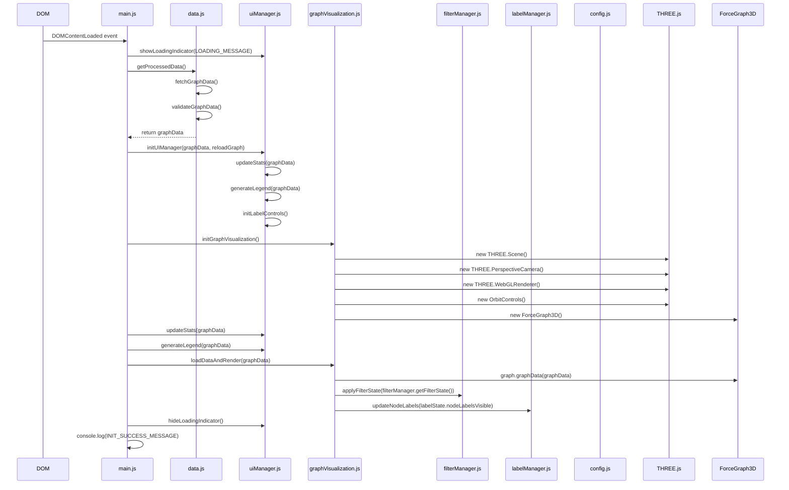

# Application Initialization Sequence

This document outlines the initialization sequence of the Knowledge Graph Viewer application using a sequence diagram. The diagram shows the interaction between different components during the application startup.

## Initialization Flow

1. When the DOM is fully loaded, the `initializeApp()` function in main.js is triggered.
2. The application shows a loading indicator and fetches graph data from the server.
3. The UI manager is initialized with the graph data and sets up event listeners.
4. The graph visualization is initialized by setting up THREE.js components and ForceGraph3D.
5. Statistics and legend are updated with the graph data.
6. The graph data is loaded into the visualization and rendered.
7. The loading indicator is hidden, and the initialization is complete.

This sequence diagram provides a clear visualization of how the different components interact during the application initialization process. 

## Component Descriptions

### Internal Files
- **main.js**: The entry point of the application that orchestrates the initialization process.
- **data.js**: Handles data fetching, validation, and processing.
- **uiManager.js**: Manages UI elements, statistics, and legend generation.
- **graphVisualization.js**: Sets up and manages the 3D graph visualization.
- **filterManager.js**: Manages the visibility state of different node types.
- **labelManager.js**: Manages the visibility state of node and link labels.
- **config.js**: Provides configuration constants for the application.

### Third-Party Libraries
- **THREE.js**: A JavaScript 3D library used for rendering the graph.
- **ForceGraph3D**: A 3D force-directed graph visualization library built on top of THREE.js.
- **OrbitControls**: A THREE.js control for camera manipulation.

